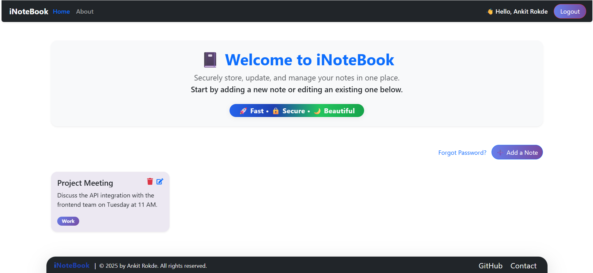

# iNoteBook-app-Frontend

This is the frontend for the iNoteBook application, built with React.  
It allows users to register, log in, manage notes, and reset passwords.

🚀 **Live Demo**: [iNotebook App](https://inotebook-app-plum.vercel.app/)



## Features

- User authentication (register, login, logout)
- Create, read, update, and delete notes
- Password reset via email
- Responsive UI

## Getting Started

### Prerequisites

- Node.js (v14+ recommended)
- Backend API running (see [iNoteBook-app-Backend](https://github.com/ankitrokde1/iNoteBook-app-Backend))

### Installation

1. **Clone the repository:**
   ```sh
   git clone https://github.com/your-username/iNoteBook-app-Frontend.git
   cd iNoteBook-app-Frontend
   ```

2. **Install dependencies:**
   ```sh
   npm install
   ```

3. **Configure environment variables:**
   - Create a `.env` file and set:
     ```
     REACT_APP_API_URL=http://localhost:5000
     ```

4. **Start the app:**
   ```sh
   npm start
   ```
   The app will run on `http://localhost:5173` by default.

## Folder Structure

```
src/
  components/    # React components
  context/       # Context API for state management
  pages/         # Page components (Home, Login, Signup, etc.)
  App.js         # Main app component
  index.js       # Entry point
.env.example     # Example environment variables
```

## License

This project is licensed under the MIT License.
